# 现代化支付系统 Advanced Paying System

​		按照巴塞尔委员会（BCBS）的分类方法，金融科技活动主要分为支付结算、存贷款与资本筹集、投资管理、市场设施（包括分布式账户）四类。

​		其中，支付结算包括包含手机和网络支付、电子货币以及区块链等；存贷款与资本筹集包括众筹、P2P网贷、电子货币、区块链等；投资管理包含机器人投资顾问、电子自动交易、智慧合同等；市场设施包括电子聚合器、大数据、云计算、电子身份认证等。

| 术              语                                | 解释                                                         |
| ------------------------------------------------- | ------------------------------------------------------------ |
| 金融科技                                          | 按照巴塞尔委员会（BCBS）的分类方法，金融科技活动主要分为支付结算、存贷款与资本筹集、投资管理、市场设施（包括分布式账户）四类。 |
| 支付结算                                          | 狭义指货币给付及其资金清算的行为，具有一定的法律特征，主要功能是完成资金转移。 |
| 支付结算体系                                      | 支付结算体系主要包括支付工具，[支付系统](https://baike.baidu.com/item/支付系统)，支付服务组织和相关的法规制度等。 |
| 传统支付                                          | 现金支付，[票据交换](https://baike.baidu.com/item/票据交换)  |
| 电子支付                                          | 电子联行，电子汇兑，中国现代化支付                           |
| [网络支付](https://baike.baidu.com/item/网络支付) | 支付网关，电子钱包，[电子货币](https://baike.baidu.com/item/电子货币) |

​		按照巴塞尔委员会（BCBS）的分类方法，金融科技活动主要分为支付结算、存贷款与资本筹集、投资管理、市场设施（包括分布式账户）四类。

​		其中，支付结算包括包含手机和网络支付、电子货币以及区块链等；存贷款与资本筹集包括众筹、P2P网贷、电子货币、区块链等；投资管理包含机器人投资顾问、电子自动交易、智慧合同等；市场设施包括电子聚合器、大数据、云计算、电子身份认证等。		

​		支付结算有广义和狭义之分。狭义的支付结算是指单位、个人在社会经济活动中使用现金、票据（包括支票、本票、汇票）、银行卡和汇兑、[托收承付](https://baike.baidu.com/item/托收承付/389896)、委托收款等[结算方式](https://baike.baidu.com/item/结算方式/4390663)进行货币给付及其[资金清算](https://baike.baidu.com/item/资金清算/3612987)的行为，其主要功能是完成资金从一方当事人向另一方当事人的转移 [1]  。

​		广义的支付结算包括[现金结算](https://baike.baidu.com/item/现金结算/4633089)和银行转账结算。支付结算作为一种要式行为，具有一定的法律特征。 

## 支付结算体系

​	支付结算体系主要包括支付工具，[支付系统](https://baike.baidu.com/item/支付系统)，支付服务组织和相关的法规制度等。

## 货币账户

* 国际货币账户体系

  
  
* 数字货币账户体系

  
  
* 货币账户体系

  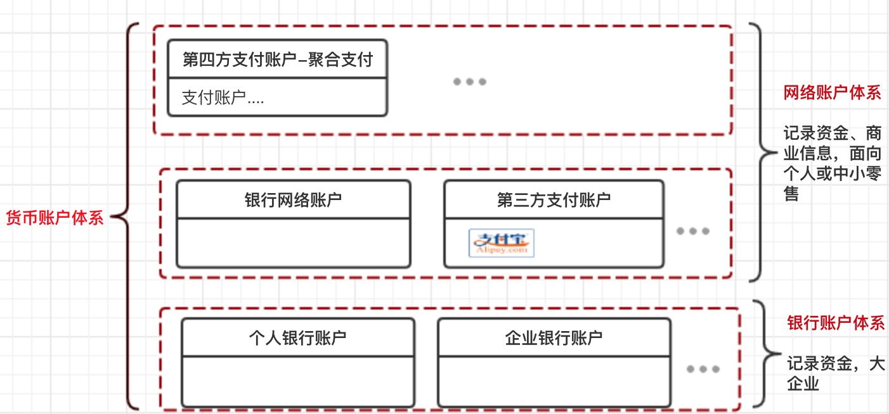

## 支付结算

中国支付清算协会
中国互联网金融协会

## 中国人民银行

##人行清算体系

XX商业银行备付金

## XX商业银行清算体系

客户存款----->待清算辖区内往来

待清算辖区内往来---->往账（待清算）

往账（待清算）-->存放央行

## 清结算组织
中国银联-银行卡支付清算系统 、收单

网联清算

## 银行系统
存款

贷款

银行中间业务  https://fanshuangstrive.github.io/

外汇买卖

股票与债券

### 支付体系

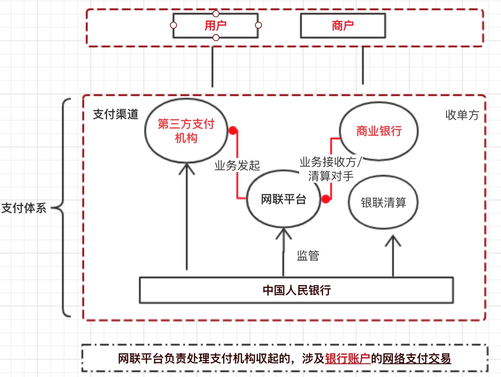

## 互联网金融

网络小额贷款

高盛

## 风控

## 交易撮合

## 第三方支付

支付机构(人行许可)
艾瑞咨询-第三方支付 参考 http://www.iresearch.com.cn/
非金融机构支付业务设施技术要求-20141124.pdf

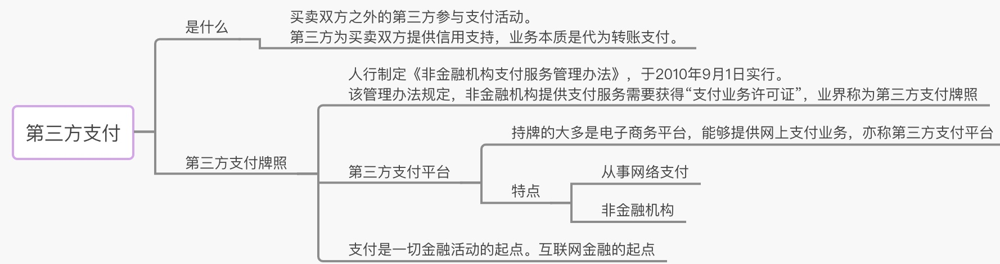

## 第四方支付(聚合支付)
电商支付系统： 

参考 http://blog.lixf.cn/ 凤凰牌老熊

企业支付平台总体系统架构

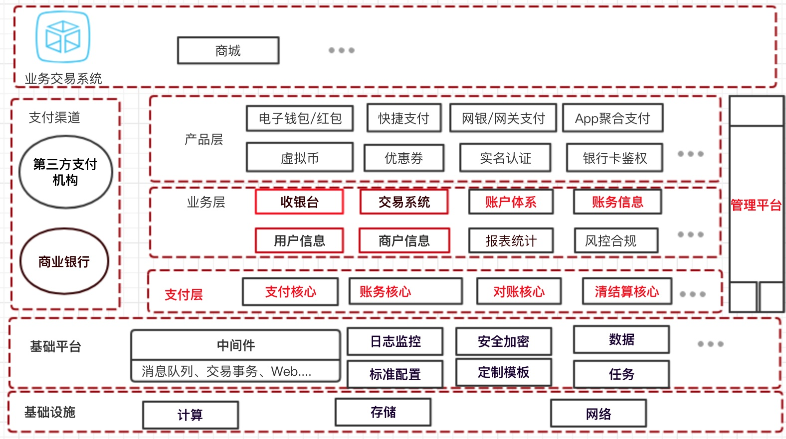

### 互联网支付-资金处理

1.交易核心

2.账务清结算

3.对账核心

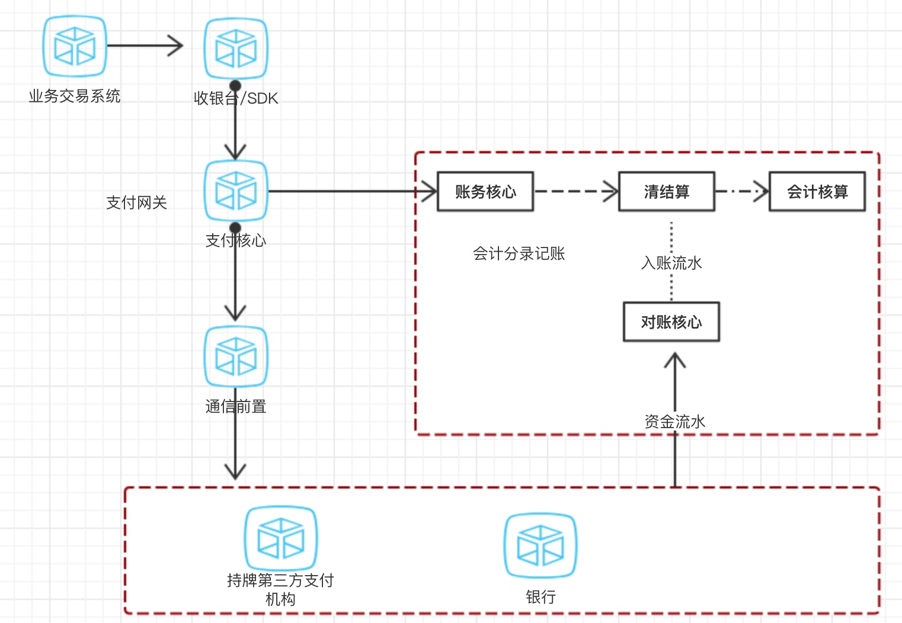

## 三户模型

账户：用户资金账户：个人客户、企业客户在聚合支付平台、持牌第三方支持机构、银行开立。

用户：1. 注册用户，也称登录账号 2商户 ，对应企业客户

客户：个人客户、企业

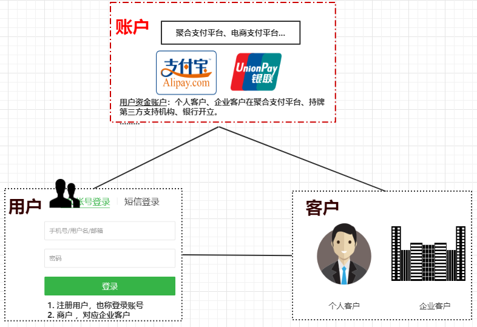

## 会计术语

参考  https://fanshuangstrive.github.io/

| 术      语   | 解释                                                         |
| ------------ | ------------------------------------------------------------ |
| 单式记账法   | 单式记账法是一种简单而又不完整的[记账](https://baike.baidu.com/item/记账/10656158)方法，它对每一一项经济业务，只在一个账户中登记，反映经济业务的一个方面，一般只反映现金收付及人欠、欠人事项，而不反映现金收付及债权、债务的对象 |
| 复式记账法   | 复式记账法是指对每一笔经济业务都要以相等的金额，同时在两个或两个以上相互联系的账户中进行登记的记账方法。 能够反映经济活动的来龙去脉。 |
| 会计核算职能 | 会计核算职能是会计运用一系列专业方法，主要使用货币计量单位，对经济活动中的过程和结果进行确认、计量、记录和报告，为有关方面提供有用的信息。 |
| 会计科目     | 会计科目按其反映经济内容的不同一般分为资产类、负债类、所有者权益类、收入类、费用类、利润类六大类科目。 |
| 会计分录     | 会计分录是按照一定的标准格式来明确每笔交易所影响到的账户和金额的记录。 |
| 账户         | 账户是根据会计科目设置的，具有一定格式和结构，用于反映会计要素的增减变动情况及其结果的载体。 |
| 借贷         | 会计学中只是一个记账的方向符号，增加减少是由账户属性决定。   |
| 会计日期     | 会计核算统计的最小单位。账务日期                             |
| 日切         | 会计日终统计和汇总各类报表，例如统计账户、科目发生额、余额   |
| 权责发生制   | 权责发生制又称“应收应付制”。它是以本会计期间发生的费用和收入是否应计入本期损益为标准，处理有关经济业务的一种制度。 |
| 收付实现制   | 收付实现制亦称“收付实现基础”或“现收现付制”。是“权责发生制”的对称。在会计核算中，是以款项是否已经收到或付出作为计算标准，来确定本期收益和费用的一种方法。 |

​		

​		单式记账法是 “[复式记账法](https://baike.baidu.com/item/复式记账法)”的对称。除对于有关人欠、欠人的现金、银行存款收付业务在两个或两个以上有关账户中登记外，其他经济业务，只在一个账户中登记或不予登记的简单，不完整的[记账方法](https://baike.baidu.com/item/记账方法)。其特点是平时只登记现金、银行存款的收付业务和各种往来账项

​		权责发生制又称“应收应付制”。它是以本会计期间发生的费用和收入是否应计入本期损益为标准，处理有关经济业务的一种制度。凡在本期发生应从本期收入中获得补偿的费用，不论是否在本期已实际支付或未付的货币资金，均应作为本期的费用处理；凡在本期发生应归属于本期的收入，不论是否在本期已实际收到或未收到的货币资金，均应作为本期的收入处理。实行这种制度，有利于正确反映各期的费用水平和盈亏状况。

​		收付实现制亦称“收付实现基础”或“现收现付制”。是“权责发生制”的对称。在会计核算中，是以款项是否已经收到或付出作为计算标准，来确定本期收益和费用的一种方法。凡在本期内实际收到或付出的一切款项，无论其发生时间早晚或是否应该由本期承担，均作为本期的收益和费用处理。

## 会计核算

### 三联单

支付结算：三联单(账户)、收银台、电子钱包（预付款）

**货币账户体系：信息流、物流、资金流** 

**电商核心方面：交易、物流、金融**

1.传统百货商场收银台、三联单：银行账户体系

2.网络支付+电子钱包：银行账户体系+网络账户体系

物流：订单：下单、付款 配货 发货 完成

### 会计核算基本框架

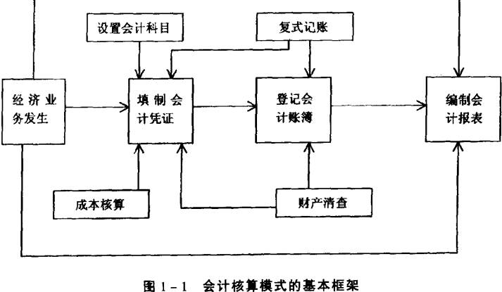

### * 经济业务

入金

出金

平台内：红包、优惠券、资金调拨....

### * 设置会计科目

### * 会计凭证

### * 会计记账

### * 会计对账

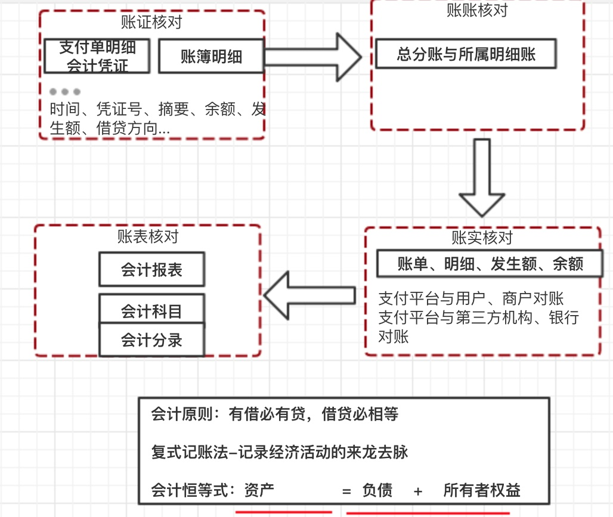

### 会计报表

### 会计科目与账户

会计账户记载账户主体经济活动的信息流。总分类科目就是我们说的总账科目或者叫一级科目，明细分类科目，也就是明细科目 
只有叶子科目下才能开立账户，非叶子科目下不可以开立账户。

资产类 负债类、所有者权益类、共同类账户

应收账款Accounts Receivable

预收账款 Advance From 

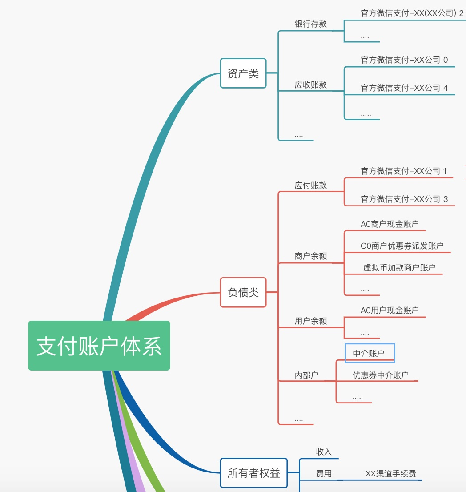

### 会计账户

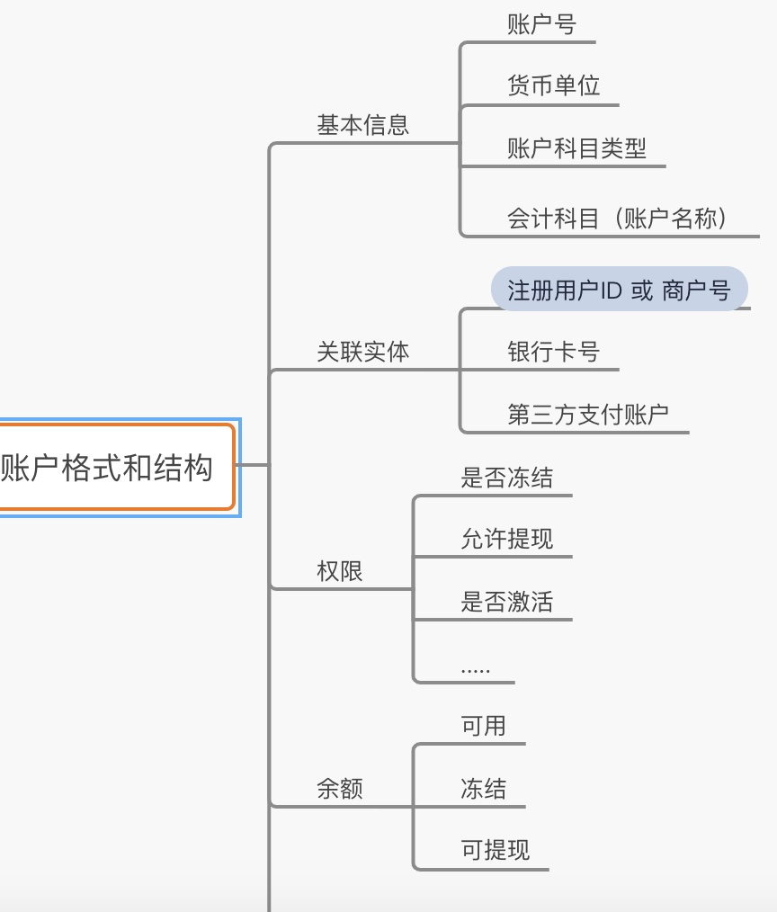

### 会计账务

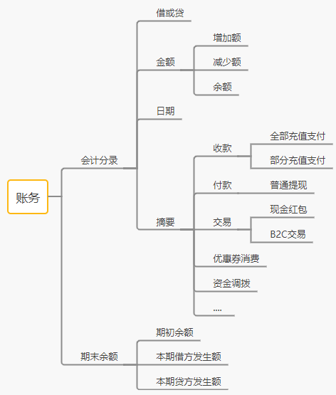

### 借贷记账法

记账方法：借贷记账法，复式记账的一种

参考 复式记账法-记录经济活动的来龙去脉 https://fanshuangstrive.github.io/

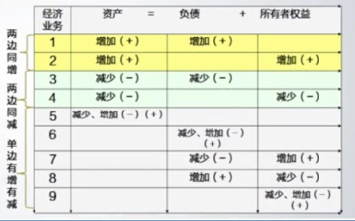

> https://zhuanlan.zhihu.com/fanshuangstrive

