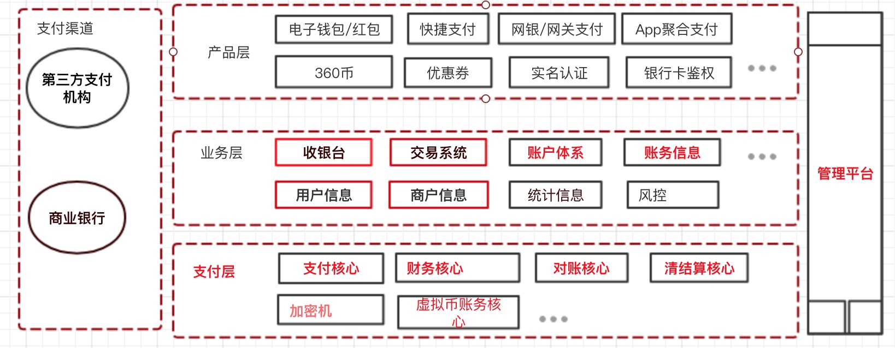

# 现代化支付系统 Advanced Paying System

## 货币

* 国际货币账户体系

  
  
* 数字货币账户体系

  
  
* 货币账户体系

  

## 支付结算
中国支付清算协会
中国互联网金融协会

## 中国人民银行

## 清结算组织
中国银联-银行卡支付清算系统 、收单

网联清算

## 银行系统
银行中间业务  https://fanshuangstrive.github.io/

### 支付体系

## 互联网金融

网络小额贷款

高盛

## 第三方支付

支付机构(人行许可)
艾瑞咨询-第三方支付 参考 http://www.iresearch.com.cn/
非金融机构支付业务设施技术要求-20141124.pdf

## 第四方支付(聚合支付)
电商支付系统： 参考 http://blog.lixf.cn/ 凤凰牌老熊
移动支付网

### 互联网支付-资金处理

1.交易核心

2.账务清结算

3.对账核心

## 三户模型

账户：用户资金账户：个人客户、企业客户在聚合支付平台、持牌第三方支持机构、银行开立。

用户：1. 注册用户，也称登录账号 2商户 ，对应企业客户

客户：个人客户、企业

## 会计

### 三联单

支付结算：三联单(账户)、收银台、电子钱包（预付款）

货币账户体系：资金流 、信息流、物流

1.传统百货商场收银台、三联单：银行账户体系

2.网络支付+电子钱包：银行账户体系+网络账户体系

物流：订单：下单、付款 配货 发货 完成

### 会计核算基本框架

### * 经济业务

入金

出金

平台内：红包、优惠券、资金调拨....

### * 设置会计科目

### * 会计凭证

### * 会计记账

### * 会计对账

### 会计报表

###会计科目与账户

**会计账户记载账户主体经济活动的信息流**。
总分类科目就是我们说的总账科目或者叫一级科目 ，明细分类科目，也就是明细科目 
只有叶子科目下才能开立账户，非叶子科目下不可以开立账户 

资产类 负债类、所有者权益类、共同类账户

应收账款Accounts Receivable

预收账款 Advance From 

### 会计账户

### 会计账务

### 借贷记账法

记账方法：借贷记账法，复式记账的一种

参考 复式记账法-记录经济活动的来龙去脉 https://fanshuangstrive.github.io/

> https://zhuanlan.zhihu.com/fanshuangstrive