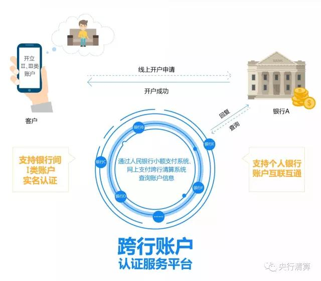

2018年1月25日，伴随着21家商业银行机构接入，中国人民银行跨行账户信息认证服务平台（以下简称“CBAC平台”）**上线参与机构突破100家**，机构类型囊括全国性股份制商业银行、城市商业银行、农村商业银行、农村信用联合社以及民营银行，覆盖全国超过二十个省、市、自治区，助力银行间个人账户的互联互通，支持账户分类业务的快速发展。

为贯彻落实人民银行《关于改进个人银行账户服务加强账户管理的通知》《关于落实个人银行账户分类管理制度的通知》精神、不断满足银行机构为个人客户开立账户的合规性要求，中国人民银行清算总中心积极响应市场需求，于2017年9月推出跨行账户信息认证服务，为银行客户跨行使用个人账户信息、通过电子渠道开立II、III类账户提供实时、可靠的认证渠道。

**CBAC平台采用签订和管理标准化协议的方式为参与者提供账户信息互联互通服务。**中国人民银行清算总中心依照市场化运营原则，以自愿为基础，统一组织各参与机构签订标准化的跨行账户认证服务协议。CBAC平台充分利用现有资源，发挥人民银行支付清算系统的规模效应，实现个人跨行账户信息的互联互通，优势显著：

**一是**严格按照监管要求，规范账户信息五要素认证；

**二是**覆盖丰富多样的银行机构种类，统一签订、集中管理标准化服务协议，进一步促进银行间合作；

**三是**统一账户信息认证规则，约束并监测应答的时效性。

加强个人账户分类管理是防范支付结算风险、切实落实银行账户实名制的必然要求，也是改进个人银行账户服务的前提条件。随着越来越多秉持着发展创新、共享普惠理念的机构加入，平台覆盖的账户资源日益丰富，支持的认证业务持续增长。

**中国人民银行清算总中心将以高效、开放、共享的服务理念，欢迎更多的银行业金融机构加入CBAC平台**，便利电子渠道个人银行账户的开立和使用，更好满足社会公众日益增长的、多样化的支付服务需求和资金保护需求，有效助力我国普惠金融发展。

