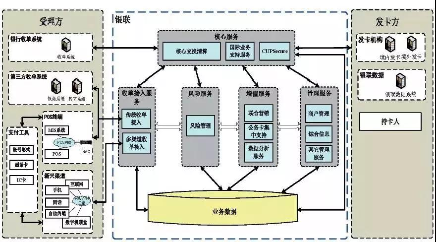
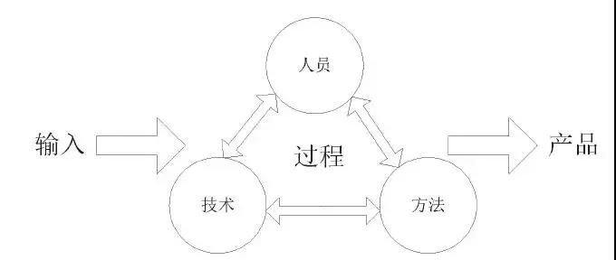

建成了能够满足数十亿银行卡，数亿持卡人，数千万商户支付需求的核心交换系统（图1），**交易并发处理能力达到每秒万笔**、整**个交易链仅需秒级交易时间**，跨行交易成功率提升到99%以上，

http://mp.weixin.qq.com/s/pI0wl8NkaeNyRsXjCEg43A

## 【观点】银行卡支付结算体系建设与发展

*2018-01-18* *柴洪峰* [中国支付清算协会](https://mp.weixin.qq.com/s?__biz=MzA3MTE0MTE3NA==&mid=2651077277&idx=1&sn=cde743a7a3d93102c149d595151bb178&chksm=84c288c4b3b501d20328649fce5470c5ccf4805924370c2cd6e69d14db2ad6d011c9b5aff31e&scene=0&key=1405b426e268d33ad3567060ed5f5435ad5a94fe3581b2160ad5bf41934e94c3903118f7f5846b7d95ad96f4614eb74bb6007973ae2de8653683f80368dce2c863134bc5e117b422eb6c579ab8ec879e&ascene=1&uin=OTUxMjM0ODEy&devicetype=Windows+7&version=6206014b&lang=zh_CN&pass_ticket=pKDHJB2hUNjmOYZYxk8BoA%2BzsU%2FgOiFKR9zAKeU5kUDbl7T7hbLlsBCb5zbXFyWd&winzoom=1##)

　　以发展电子货币为目的、以电子货币应用为重点的金卡工程是我国金融信息化建设的起步工程之一，极大地推动了我国银行卡产业的发展。到2016年，我国已累计发行银联卡65亿张，全年银行卡跨行交易金额72.9万亿元，超过国际主要银行卡公司，均达到全球第一。银行卡跨行交易成功率达到99%以上，银行卡渗透率达到48%。

　　从系统工程的角度看，银行卡信息化系统是一个开放的复杂系统，银行卡信息化建设工程存在着明显的开放性、复杂性、巨量性等系统工程特征。这项工程不仅要解决转接清算组织自身的信息化建设问题，还要解决整个银行卡产业参与者之间信息化发展不平衡的问题；不仅要解决银行卡产业内部的问题，还要解决产业外部环境保障的问题。

**我国银行卡信息化工程方法**

　　坚持多学科集成、多部门协作，运用系统工程实施科学管理，是我国银行卡产业持续发展的有效方法。在银行卡信息化工程建设中，基于银行卡产业的互相协同和经验总结，通过信息技术集成创新，提炼归纳了符合中国国情的银行卡信息化工程方法。

**1.坚持宏观有序、整体最优的顶层设计思路**

　　在银联建立跨行交换系统以前，银行卡服务网络分散、交易质量低，成功率仅为48%，工程规模庞大，功能复杂，接口繁多，兼容性、安全性、可靠性、稳定性要求高，时间跨度长，整体推进难。针对银行卡产业复杂规划问题，在2002年银行卡跨行交换系统工程正式启动时，按照“抓主要矛盾”为指导思想，从顶层设计入手，遵循整体最优、层次合理、协同有序三项基本原则，制定了三大总体设计要求：一是工程规划强调全面性、系统性、协同性，二是系统设计具备标准兼容性、安全性，三是方案计划可操作性、落地性强。

　　通过从总体设计入手，工程组织规划和论证了银行卡转接集中、清算统一、以及基于云计算的电子支付平台三个工程阶段，以整体性原则和综合性原则进行系统规划，通过多层次的产业链交互，提升整体系统面向复杂环境变化的主动性和适应性，持续优化系统模型和单元构件，建成了能够满足数十亿银行卡，数亿持卡人，数千万商户支付需求的核心交换系统（图1），**交易并发处理能力达到每秒万笔**、整**个交易链仅需秒级交易时间**，跨行交易成功率提升到99%以上，在交易处理能力方面达到了国内领先，国际先进水平。中国银联卡的金融服务已推广到160个国家和地区。

图1 中国银联银行卡信息交换系统架构图

**2.建立枢纽，标准先行**

　　银联成立后，银行通过中国银联的全国统一的转接清算网络和跨行转接标准体系，实现了交易清算系统的互联互通，进而使银行卡得以跨银行、跨地区和跨境使用。产业的标准化水平逐步提高，产业链上的所有合作实体开始采用同一种技术语言来进行沟通，交易的标准化率和信息处理效率不断提高，带来了交易质量质的飞跃，推动了银行卡产业规模化发展。

　　对于银行卡产业来说，技术标准不仅仅是规范各类技术研发、统一通信接口、降低产业总成本、协调产业各环节发展、整合资源、提高工作效率，更重要的是标准先行的思路明确指引了创新方向、加快了国际化进程，加速了银行卡行业的整体持续发展。至2016年，银行累计发行银联卡超过65亿张,全球第一。银行卡总交易量，由2002年12万亿元，增长到2016年741.81万亿元，增长61.8倍；2016年银行卡跨行交易金额72.9万亿元，更是增长了405倍。银行卡跨行支付系统联网商户2000万户，联网POS机具2400万台，ATM 80万台,银行卡消费金额占社会消费品零售总额的比重持续增长，从2002年的2.7%提高至2016年的49%，对便民便商、拉动内需、扩大消费、促进就业和经济发展发挥了重要作用。

**3.建立前瞻性创新组织机制**

　　现代支付业在创新组织机制上，应用了市场需求和技术发展的“双驱动”机制。在市场需求驱动层面，建立面对市场变化和客户需求变化的快速传导机制，从市场调研和用户反馈捕捉创新研发课题，并按照明确性、衡量性、可实现性、相关性、时限性等原则建立目标管理机制，划分创新类型，针对创新需求、改进需求和原型概念等不同层级、不同优先级的需求类型，采取不同的创新实施路径，形成对应解决方案，对现有系统进行优化完善或开展技术预研。在技术驱动层面，采用新技术引领产品设计，按照“两端两级”要求，即：客户端极致用户体验，平台端极致安全可靠，推动产品不断优化。在面向用户的产品中，尤其是升级更新快速的金融支付产品中，要分清轻重、缓急，找到用户需求的痛点，将用户“最核心”需求的体验做到极致。

**4.建立面向复杂系统的需求管理方法**

　　在需求管理过程中，根据综合集成工程方法，建立符合银行卡产业规律的，面向复杂系统的需求管理方法（图2）。该方法的基本思想观点是遵循银行卡产业业务研究的整体性、技术应用的综合性和管理决策的科学性等系统工程原则。其中整体观点是把银行卡产业链各系统内部所有要素看成一个整体，从更高的角度来分析系统与环境的关系，将银行卡产业的实践经验、理论知识、统计数据与计算机技术有机结合，通过专家研讨，建立了用于需求分析和论证的数学模型和仿真系统。对于复杂需求通过模型进行模拟和仿真，并进行大规模原型验证和专家论证，得出验证结果和解决方案。通过综合应用实证研究和经验判断，实现产业体系建设、工程需求实现和项目目标实施三项工作的协调同步，并与机器体系、专家体系和知识体系有机融合，确保了复杂银行卡信息交换系统的需求的正确性、准确性和可实现性。

图2 复杂系统需求管理方法

**5.技术标准安全分层方法**

　　由于业务需求的不断发展和产品形态的日益增多，需形成以“安全原则”和“双向模型”为核心的技术标准安全分级分层管理方法。即将标准分为上层的安全原则和下层的具体标准，通过对同类标准的基础性安全要求进行提炼总结，形成一套金融支付类技术标准的规范原则，用来指导下层具体标准的编写完善。上层的安全原则和下层的具体标准不是单向的管理关系而是形成相互作用、相互参照、相互完善的双向模型。

　　首先自上而下，上层原则起到三个方面的作用：一是起到安全指南作用，上层原则通过提供编写原则及框架安全，指导下层标准基础安全内容的编制，使标准编写内容完备并达到规定的安全水平。二是起到检验作用，验证技术标准的基础安全强度并评分，保障具体标准的业务安全和逻辑安全。三是同步完善，上层原则随着市场新技术的发展不断丰富完善，并作用于下层标准，促进标准的不断补强，形成周期性的自主优化完善机制。

　　其次自下而上，下层标准起到促进原则完善的推动作用，下层标准的制定完善过程中，不断反作用于上层原则，检测安全原则覆盖面是否全面。下层标准在实践应用、不断完善其安全防御能力的同时，也向上层原则提出完善需求，促进整体通用安全强度和完整性的提升。

**6.注重产业平衡的均衡升级方法**

　　其核心是策略、机制、评价等多种方法的综合运用。实施“两平衡”创新策略，即把控产业投入和风险防范的平衡，把握技术先进性和市场普及性的平衡；产业产品化研发方面，实施“双模式”研发机制，坚持关键性技术实现自主研发，共性的基础性技术引入产业界合作伙伴联合研发；在效果评价上，实施提升企业自身竞争力，和带动产业协同发展的综合平衡“双效果”评价体系，建立可持续的综合平衡的产业化路径。从而产生整体大于各部分之和的效应。

**7.一体化运营方法**

　　对于银行卡信息化工程来说，信息化系统的建成不是工程的终极目标。评判一个信息化系统核心价值的决定因素是其是否拥有优秀的日常运营管理能力，能否为客户创造长期价值，实现平台、客户乃至整个商业生态的动态可持续发展。因此，信息化工程在建设“硬系统”的同时需要推动建立完善的日常运营管理体系，长期稳定输出优秀服务和产品价值。

　　信息化系统的日常运营就是将资金、方法等要素以及人员、信息、应用、基础设施等IT资源通过一系列的运作变为服务产品输出给客户（图3）。

图3 运营管理过程

　　生产运营的过程是“人员、技术、方法”的集合，只有人员、技术、方法之间互相匹配，就象齿轮之间的相互啮合得好，生产运营过程才能平衡、顺畅和连续地运转。应用系统工程方法就是将平台运营从端到端看成整体，通过建立运营管理整体系统对运营进行组织和管理，并建立螺旋上升的流程制度，探索、适应与熟悉新的技术和运营方法，促进运营服务管理模式的不断升级。在银行卡信息交换系统工程实践中，提出并建立了一体化运营方法，以客户为中心，将传统的系统运维，提升到目录式、规范化、端到端、客户至上的平台运营。一体化运营管理的核心，是从客户体验角度出发，建立服务内容、流程制度、组织结构、工具平台、质量监控和持续优化体系和机制，通过服务水平协议、效果评估算法等量化方法实现全程量化管理。

**银行卡信息化整体发展趋势**

**及金融科技的重点把握**

　　十九大报告将“加快建设创新型国家”作为重要的新发展理念，指出创新是引领发展的第一动力，是建设现代化经济的战略支撑，将创新驱动发展战略作为全面建成小康社会、进而全面建成社会主义现代化强国的重要战略。金融支付行业应该按照国家的总体规划，围绕“服务实体经济、防控金融风险、深化金融改革”三项任务，结合一带一路战略，积极推进普惠金融、绿色金融，为“两个100年”的奋斗目标添砖加瓦。围绕国家整体战略规划、结合金融科技发展方向，关注研究全球性、开放性的新产品、新模式、新业态，做好金融科技创新布局。

**1.服务普惠金融、绿色金融**

　　现代支付体系是普惠金融、绿色金融的基础。发展普惠金融、绿色金融是供给侧结构性改革的重要内容。农村地区和偏远地区金融消费的受理环境建设相对滞后，银行卡交易渗透率相对较低，绿色产业正处在发展新阶段，需要建立符合地区特色的，支持普惠金融、绿色金融发展的现代支付基础设施，满足老百姓消费需求，符合人类追求可持续发展的目标。中国普惠金融、绿色金融的技术路径是“数字金融”，大数据处理、人工智能、云计算、移动互联、物联网等数字技术的集成应用。倡导数字技术，把握创新与风险的平衡关系，稳步推出可靠的数字身份识别机制，建立开放的数字金融服务平台，探索普惠金融与绿色金融精准扶贫相结合的路径，立足扶贫普惠、数据普惠、绿色普惠等建设，进一步推动普惠金融、绿色金融的创新应用，促进信息共享，降低交易成本和金融服务的门槛，促使小微企业、中低收入人群等弱势群体享受同等的金融服务，积极参与绿色金融领域的国际合作，研究国际上通行的赤道原则，提供商业上的可持续性，成本上的可控性和技术上的可行性，有效扩大金融服务的覆盖面。

**2.积极布局“一带一路”**

　　未来的科技创新，全球产业联动和技术集成的趋势越来越明显。建立全球创新网络，把全球的创新资源都有机联结起来。以外部合作为导向，以跨国协同为引领，以机制建设为手段，以数据共享为依托，以风险管控为保障，通过科技创新推动“一带一路”金融创新。随着国家“一带一路”战略稳步推进，将促使人民币银行卡在支付市场的接受度不断提升、人民币清算服务持续扩大，为加快人民币国际化提供了可能，也为国内银行卡专业化系统服务及标准的输出提供了机遇。要充分考虑市场发展趋势，紧跟国家发展策略，与境外机构开展战略合作，从支持当地基础设施建设、加快当地用卡环境优化、加大本地化支付产品创新等多方面着手，分享银行卡产业发展的经验，共享合作成果，稳步推进人民币国际化工作。

**3.探索区块链技术研究，密切跟踪开源技术**

　　区块链技术作为一种底层数据库技术，为金融行业提供了一种高互信、高效稳定、降低成本的科技解决方案，将为金融领域的经营模式、服务方式、流程优化、监管模式等多个方面带来创新机遇。金融支付行业应重点围绕关键技术和应用场景，积极跟踪和探索区块链的研究和应用。

　　开源软件经过近几十年的快速发展，尤其是在云计算、大数据等技术的推动下，已经在许多企业得到了广泛应用。应从研究开源、应用开源、实践开源三个方面推进开源各项工作。首先是研究开源，研究各类开源软件的优缺点、成熟度和成长趋势，评估开源软件知识产权风险，为金融机构开源软件选型提供支持；二是应用开源，积极引入开源软件，开展二次开发和集成创新，形成金融行业最佳实践；三是实践开源，探索将部分技术创新和系统开发成果开源化的方法，利用开源组织产业开展联合技术攻关与创新。

**4.加大人工智能研究与应用**

　　近年来，人工智能成为行业热点，学术、科技、产业、政府等各方以不同方式参与到人工智能热潮中，研究领域在不断扩大,包括专家系统、机器学习、进化计算、模糊逻辑、计算机视觉、自然语言处理、推荐系统等。人工智能要重视大众刚性需求，要建设从算法、软件、人机界面、系统结构和物联网感知事件驱动的产业链和生态环境。金融行业应更加重视人工智能工作，制定合理的工作策略，开展基础能力建设；积极探索应用场景，加大宣传力度，及时树立正面形象；加强产业联动，推动行业智能升级。实现金融业务高度智能化，全面提升用户体验，有效防范风险，践行数据驱动业务发展。

**5.加强金融监管技术研究与应用**

　　新技术的应用对风控管理和金融监管提出了挑战，应该依据不同金融基础设施的性质分类施策，从传统的静态合规式的安全管理，向动态博弈，容侵容错、高效配置安全资源的思路转变，达到实质性的安全效果。统筹协调，强调安全数据共享、联防联控机制，从全局的层面保障我国金融基础设施的整体防护。

　　随着信息技术的发展和金融科技的进步，大数据、云计算、人工智能、移动互联等推动支付产业发生变革，使得整个支付产业朝着移动化、智能化、场景化的方向发展。特别是最近几年，整个支付技术的快速发展，促进了思维方式的转变，树立大数据思维、时空观思维、物联事件驱动思维；以用户为中心，在技术上和场景上不断的探索实践。通过联动融合，打造金融科技创新队伍，夯实金融科技创新人才基础，争取金融科技时代的主动权，为我们的用户提供安全、便捷、智能的支付服务，实现普惠金融、绿色金融的整体产业升级。

 

作者：中国工程院院士、中国银联董事 柴洪峰

来源：金融电子化

· END ·

欢迎关注中国支付清算协会官方微信：点击标题下方“中国支付清算协会”；搜索微信公众号“中国支付清算协会”；保存下方二维码图片，并从相册中扫描二维码；或长按下方二维码图片，并点选“识别图中二维码”。

内容转载自公众号金融电子化了解更多

[投诉](https://mp.weixin.qq.com/s?__biz=MzA3MTE0MTE3NA==&mid=2651077277&idx=1&sn=cde743a7a3d93102c149d595151bb178&chksm=84c288c4b3b501d20328649fce5470c5ccf4805924370c2cd6e69d14db2ad6d011c9b5aff31e&scene=0&key=1405b426e268d33ad3567060ed5f5435ad5a94fe3581b2160ad5bf41934e94c3903118f7f5846b7d95ad96f4614eb74bb6007973ae2de8653683f80368dce2c863134bc5e117b422eb6c579ab8ec879e&ascene=1&uin=OTUxMjM0ODEy&devicetype=Windows+7&version=6206014b&lang=zh_CN&pass_ticket=pKDHJB2hUNjmOYZYxk8BoA%2BzsU%2FgOiFKR9zAKeU5kUDbl7T7hbLlsBCb5zbXFyWd&winzoom=1##)