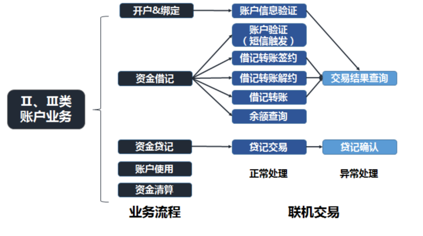

银联无卡快捷支付业务-兴业数金

银联无卡快捷支付业务是指银行账户合法所有者（以下简称“持卡人”）利用手持通讯设备、个人计算机等电子设备，未采用读卡方式，依托公共网络信息系统传输信息，通过安全支付界面输入交易要素，确认发起并完成资金划付的业务（以下简称“无卡快捷支付业务”）。 银联无卡快捷支付服务为发卡和收单机构提供无卡快捷支付业务的跨行转接服务。

银联无卡快捷支付业务是银联自主开发的新转接模式。这点很有意思，因为现在第三方支付机构无法直连银行，需要通过网联再连银行。而银联的这个无卡快捷支付系统和网联有点类似。

联机采用XML报文格式，T+1日统一清算本金和费用，通过人民银行大额支付系统划账。

业务场景：支持收单机构所需的商品购买、服务订购、公用事业缴费、资金转移等各种业务场景。

有如下的交易类型：
协议支付签约触发短信 
直接支付触发短信 
协议支付签约 
无卡支付解约 
无卡支付解约通知 
协议支付 
直接支付 
退货 
贷记付款 
交易终态通知 
交易状态及信息查询

这个通道融合Ⅱ、Ⅲ类银行借记账户、备付金账户,二维码业务等创新业务转接清算服务。目前我们也正在开发二三类账户的交易，包括如下：

无卡快捷支付前置系统。这里有一个比较有特色的地方，兴业数金是一个科技输出平台，给中小银行提供技术支持（比如核心系统），正因为这样，我们的前置系统是一个多法人的前置系统，我画了一个图，如下：

用到的技术框架：spring+mina+mybatis+logback，数据库用的是oracle，后期希望能够进行技术优化，其实有看到熊老师那几篇博客：重构到微服务！

