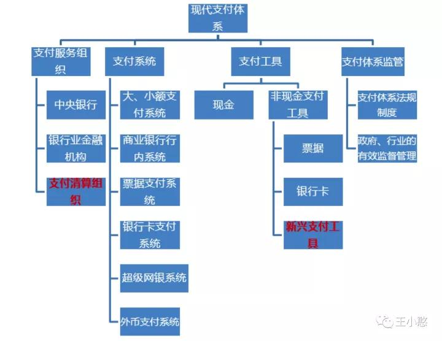

https://baike.baidu.com/item/%E4%B8%AD%E5%9B%BD%E5%9B%BD%E5%AE%B6%E7%8E%B0%E4%BB%A3%E5%8C%96%E6%94%AF%E4%BB%98%E7%B3%BB%E7%BB%9F/5843061

> 参考：知乎 微信公众号 王小憨

有些系统我们我们天天在用，但是好像一直很远，比如大额系统、小额系统、超级网银，具体是什么，有什么特性，这篇文章希望聊聊这些系统，如有不对的地方请大家随时指正。

支付系统。支付系统支撑各种支付工具的要素记载、应用，实现资金债权债务信息的清算，完成资金的转移，是经济金融体系的重要基础设施，由大小额支付系统、商业银行行内系统、票据支付系统、超级网银系统、银行卡支付系统和外币支付系统等组成。

大额实时支付系统、小额批量支付系统、超级网银系统和境内外币支付系统是目前支付系统内最重要的四个系统，他们的上线运行，标志中国现代化支付清算网络体系初步建成和完善，所以这四个系统我们可以多了解一些，其余系统银行和互联网支付接触不多，不在这作介绍。

> 大额实时支付系统（High Value Payment System，简称HVPS）。

顾名思义，主要是用来处理银行之间或者金融市场参与主体间交易金额较大的银行间或者银联（特许清算组织）的资金借贷系统。作为我国现代化支付系统的重要应用，2005年6月在全国推广使用。具有很多意义，也有很多字数，可作为一本“多些问题，少些主义”的书，并不想写意义浪费大家时间，如有兴趣可以进行相关百度。

列出大额支付系统的一些基本特性：

l 大额支付系统金额范围是什么？处理时间是什么时间？

1、处理单笔金额无明确要求，但一般大额成本比较划算；

2、系统处理业务时间是工作日8点-17点

l 收费方式怎么收费？到账时间与金额？

1、按单笔收费；

2、逐笔实时发起，工作日工作时间内实时到账，基本实现资金零在途【非工作日时间或者非营业时间均无法实现实时到账】；

3、全额结算，手续费按月从结算户里另扣；

4、大小额系统共享同一清算账户；

l 接入对象是哪些：

大额支付系统接入方分为直接参与者、间接参与者和特许参与者。

直接参与者：仅限为在央行开设有清算账户的银行机构和中国人民银行地市级（含）以上中心支行（库）。

间接参与者：是未在央行开设清算账户而委托直接参与者办理资金清算的银行和非银行金融机构以及中国人民银行县（市）支行（库）。

特许参与者：是央行批准通过可以接入大额支付系统业务的机构。比如支付清算组织【银联】。

l 处理的业务范围有哪些：

（一）规定金额起点以上的跨行贷记支付业务，比如跨行转账；

（二）规定金额起点以下的紧急跨行贷记支付业务，比如跨行转账；

（三）商业银行行内需要通过大额支付系统处理的贷记支付业务，比如本行转账；

（四）特许参与者发起的即时转账业务，比如国债结算公司发起的债券兑付；

（五）城市商业银行银行汇票移存和兑付资金的汇划业务，比如汇票承兑；

（六）中国人民银行会计营业部门、国库部门发起的贷记支付业务以及内部转账业务，比如再贴现资金处理；

（七）中国人民银行规定的其他支付清算业务

> 小额批量支付系统（Bulk Electronic Payment System，简称BEPS）。

由于其系统设定和因为多笔交易等待打包批次需要时间，相比大额支付系统具有一定延时性特性，主要是用于处理金额相对较小和紧急程度较低的交易。同样和大额支付系统一起作为现代支付系统的重要应用，于2006年6月在全国推广运行。同大额，那些意义，我们在这里不做描述。

小额批量支付系统的一些基本特性：

l 小额批量支付系统金额范围是什么？处理时间是什么时间？

1、处理单笔金额要求单笔人民币5万元以下；

2、系统处理业务时间是7x24小时，业务处理时间为自然日，资金清算时间为工作日；

l 收费方式怎么收费？到账时间与金额？

1、按组包包数和笔数以及流量收费；

a、规定报文容量以内的支付业务，按包数和笔数收费

b、超过报文容量的支付业务，除了根据包数和笔数收费外，还需要对超过部分按流量收费

2、实时发起，工作日处理到账；

3、净额结算，手续费直接扣除；

4、大小额系统共享同一清算账户；

5、清算账户，指直接接入银行机构在中国人民银行开立的、用于资金清算的人民币存款账户

l 接入对象是哪些：

小额支付系统接入方分为直接接入参与者、间接参与者和特许参与者。

直接参与者：仅限为在央行开设有清算账户的银行机构和中国人民银行地市级（含）以上中心支行（库）。

间接参与者：是未在央行开设清算账户而委托直接参与者办理资金清算的银行和非银行金融机构以及中国人民银行县（市）支行（库）。

特许参与者：是央行批准通过可以接入大额支付系统业务的机构。比如支付清算组织【银联】。

l 处理的业务范围有哪些：

贷记业务是付款行或者付款人主动向收款行或者收款人发起的付款业务。

借记业务是收款行或者收款人主动向付款行或者付款人发起的扣款业务。

（一）普通贷记业务，比如转账，从老王的工商银行转账到老李的农业银行；

（二）定期贷记业务，比如代付工资，每月定期付薪水给员工；

（三）实时贷记业务，比如银行存款，实时进账；

（四）普通借记业务，比如资金归集，一发工资，老王的招行工资就被老婆扣到她农行账户；

（五）定期借记业务，比如代收保险费用，一年一次定期去老王的招行扣款；

（六）实时借记业务，比如ATM取钱，从存款里面实时扣除了，变成现金到了手上；

（七）中国人民银行规定的其他支付业务

> 网上支付跨行清算系统(Internet Banking Payment System，简称IBPS) 又称超级网银系统。

是央行推出的第二代支付系统核心业务子系统。具备跨行实时转账、跨行查询、跨行资金归集、统一数据格式等功能，于2010年8月30日正式上线。

超级网银系统最具突破的特性在于两点:

1、支持第三方持牌公司接入系统和支持跨行转账查询以及资金归集；

2、实现7*24小时实时发起，实时到账；【原先的大小额系统在非工作日非营业时间均无法处理资金实时到账】

网上支付跨行清算系统的一些基本特性：

l 网上支付跨行清算系统金额范围是什么？处理时间是什么时间？

1、处理单笔金额要求单笔人民币5万元以下；

2、系统处理业务时间是7x24小时，业务处理时间为自然日，资金清算时间为自然日；

l 收费方式怎么收费？到账时间与金额？

1、目前还是免费，原则上规定按笔收费；

2、逐笔实时发起，实时到账；

3、净额结算，手续费直接扣除；

4、与大小额系统共享同一清算账户；

l 接入对象是哪些：

网上支付跨行清算系统接入方分为直接接入银行机构、直接接入非金融机构和代理接入银行机构

直接接入银行机构：指网上支付跨行清算系统连接并在中国人民银行开设清算账户，直接通过网上支付跨行清算系统办理业务的银行业金融机构。

直接接入非金融机构：指网上支付跨行清算系统连接，直接通过网上支付跨行清算系统办理业务的非金融支付服务机构。

代理接入银行机构：指委托直接接入银行机构通过网上支付跨行清算系统代为收发业务和清算资金的银行机构。

l 处理的业务范围有哪些：

（一）网银贷记业务，比如携程购物，从工行付钱支付费用；

（二）网银借记业务，比如定期缴纳保险；

（三）第三方贷记业务，这里是指第三方企业作为服务商，接受付款人或者收款人委托或者指令，通知付款行向收款行发起付款的业务，比如购物、还信用卡借贷记业务都包括。

（四）中国人民银行规定的其他支付业务

> 如何组合应用

目前很多银行的网银转账无论app还是online都是同时接入了大小额系统及超级网银系统；根据各自特性，选择出最优的支付通道，比如：

情形一：工作日工作时间内你的大额比如8万块需要转账，最佳处理方式是直接发起一笔8万转账，实时到账；

情形二：非工作时间比如晚上10点或者非工作日8万需要转账，最佳处理方式是分成两笔4万转账，这样银行会符合超级网银系统要求单笔少于5万的要求，实时发起，实时到账。

> 外币支付系统（ Foreign Currency Payment System，简称FCPS）。

由于商品贸易、劳务服务发展，对外币支付服务需求旺盛，央行牵头建设了我国境内外币支付系统。为中国境内银行业金融机构及外币清算机构提供外币支付服务的实时全额支付系统，并规定了代理结算银行和各自代理结算币种，于2008年在全国推广运行。同大额，那些意义，我们在这里不做描述。

外币支付系统的一些基本特性：

l 外币支付系统金额范围是什么？处理时间是什么时间？

1、处理单笔金额要求暂未有明确规定；

2、系统处理业务时间是工作日9点-17点；

l 收费方式怎么收费？到账时间与金额？

1、手续费由各代理银行报批后自行确定

2、工作日业务处理时间实时发起，实时到账；

3、全额结算，手续费另扣；

l 接入对象是哪些：

外币支付系统接入方分为参与者、特许参与者、代理结算银行。

参与者：指参加外币支付系统并在代理结算银行开设外币结算账户的银行。

特许参与者：指参加外币支付系统未在代理结算银行开设外币结算账户的外币清算机构。

代理结算银行是根据央行规定负责对外币清算结果进行结算的银行。

l 首批代理结算银行各自代理哪些币种：

l 处理的业务范围有哪些：

（一）支付类业务：比如付款业务。

（二）信息类业务：比如查询不涉及资金的业务；

## 体系结构

人民银行通过建设现代化支付系统，将逐步形成一个以[中国现代化支付系统](https://baike.baidu.com/item/%E4%B8%AD%E5%9B%BD%E7%8E%B0%E4%BB%A3%E5%8C%96%E6%94%AF%E4%BB%98%E7%B3%BB%E7%BB%9F)为核心，商业银行行内系统为基础，各地同城票据交换所并存，支撑多种支付工具的应用和满足社会各种经济活动支付需要的中国支付清算体系。

[中国现代化支付系统](https://baike.baidu.com/item/%E4%B8%AD%E5%9B%BD%E7%8E%B0%E4%BB%A3%E5%8C%96%E6%94%AF%E4%BB%98%E7%B3%BB%E7%BB%9F)建有两级处理中心，即国家处理中心（NPC）和全国省会（首府）及深圳城市处理中心（CCPC）。国家处理中心分别与各城市处理中心连接，其通信网络采用专用网络，以地面通信为主，卫星通信备份。

政策性银行和商业银行是支付系统的重要参与者。各政策性银行、商业银行可利用行内系统通过省会（首府）城市的分支行与所在地的支付系统CCPC连接，也可由其总行与所在地的支付系统CCPC连接。

## 支付作用

中国现代化支付系统的主要业务功能

为适应各类支付业务处理的需要，正在建设的现代化支付系统由大额实时支付子系统（Hign Value Payment System ，[HVPS](https://baike.baidu.com/item/HVPS)）、小额批量支付子系统（Bulk Electronic Payment System ，**BEPS**）、中央银行会计集中核算系统、[全国支票影像交换系统](https://baike.baidu.com/item/%E5%85%A8%E5%9B%BD%E6%94%AF%E7%A5%A8%E5%BD%B1%E5%83%8F%E4%BA%A4%E6%8D%A2%E7%B3%BB%E7%BB%9F)、银行业金融机构行内支付系统、银行卡支付系统六大应用系统组成。

1、大额实时支付子系统实行逐笔实时处理，全额清算资金。建设大额支付系统的目的，就是为了给各银行和广大企业单位以及金融市场提供快速、高效、安全、可靠的支付清算服务，防范支付风险。同时，该系统对中央银行更加灵活、有效地实施货币政策具有重要作用。该系统处理同城和异地、商业银行跨行之间和行内的大额贷记及紧急的小额贷记支付业务，处理人民银行系统的贷记支付业务。

2、小额批量支付子系统在一定时间内对多笔支付业务进行轧差处理，净额清算资金。建设小额批量支付系统的目的，是为社会提供低成本、大业务量的支付清算服务，支撑各种支付业务的使用，满足社会各种经济活动的需要。该系统处理同城和异地纸凭证截留的商业银行跨行之间的定期借记和定期贷记支付业务，中央银行会计和国库部门办理的借记支付业务，以及每笔金额在规定起点以下的小额贷记支付业务。小额批量支付系统采取批量发送支付指令，轧差净额清算资金。

3、中央银行会计集中核算系统是以中国人民银行地市以上机构为基本核心单位，运用计算机网络和电子通信技术，遵循会计基本原理、准则和特定方法进行设计的，集中核算、反映和管理中国人民银行各类会计业务的电算化系统。该系统提供资金最终结算服务，是中国人民银行现代化支付系统的运行基础，是中国人民银行履行各项职能的核心支付系统。

4、[全国支票影像交换系统](https://baike.baidu.com/item/%E5%85%A8%E5%9B%BD%E6%94%AF%E7%A5%A8%E5%BD%B1%E5%83%8F%E4%BA%A4%E6%8D%A2%E7%B3%BB%E7%BB%9F)是运用影像技术将实物支票截留，转换为支票影像信息，通过计算机网络将支票影像信息传递至出票人开户银行提示付款的[业务处理系统](https://baike.baidu.com/item/%E4%B8%9A%E5%8A%A1%E5%A4%84%E7%90%86%E7%B3%BB%E7%BB%9F)。

5、银行业金融机构行内支付系统作为银行业金融机构综合业务处理系统的重要组成部分，是其内部资金往来与资金清算的渠道，是其拓展支付服务市场，提升市场竞争能力的重要实施，在支付系统中居于基础地位。

6、银行卡支付系统由银行卡跨行支付系统及发卡行内银行卡支付系统组成，专门处理银行卡跨行交易信息转接和交易清算业务，由[中国银联](https://baike.baidu.com/item/%E4%B8%AD%E5%9B%BD%E9%93%B6%E8%81%94)建设和运营，具有借记卡和信用卡、密码方式和签名方式共享资源等特点。