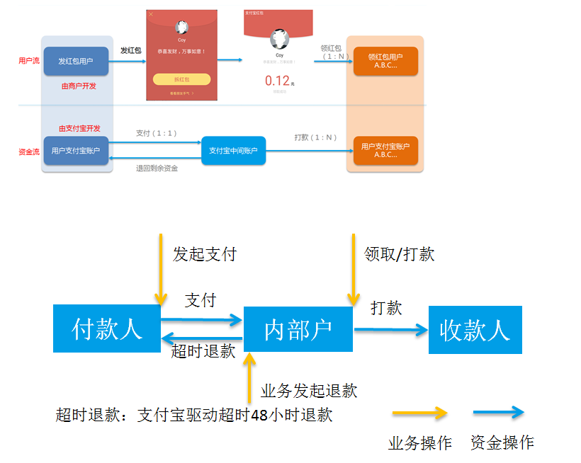

>  https://docs.open.alipay.com/    资金能力-收发现金红包产品介绍

开发文档/收发现金红包产品/产品介绍

计费模式	

# 收发现金红包产品介绍

# 更新时间：2017-0开发文档 /  收发现金红包产品 /  产品介绍 /  计费模式

收发现金红包产品介绍 更新时间：2017-08-30

为PC网站，移动应用和H5场景提供收发现金红包支付通道的一款产品。主要应用于用户与用户互发红包和企业给用户发放营销红包。开发者可以应用于IM红包（钉钉红包），H5红包等。

业务流程：

 

产品特色

专门针对红包应用的支付产品
推广期间免费产品
支付宝风控体系保证资金安全
支付宝内部中间户解决资金合规性问题
使用场景

应用案例

1）钉钉APP使用本产品实现了用户之间互发红包的功能

2）掌阅APP端内给用户发红包，有效增加端内活跃

3）MOMO直播间红包，主播与用户都可以在直播间内发现金红包，有效提升房间人气

场景举例

使用流程举例

用户之间互发红包，用户红包发放使用PC收银台或无线收银台输入支付密码支付。用户首次领取时需要获得用户支付宝账户，平台可通过用户支付宝登录号或者调用“APP支付宝登录”接口获得用户支付宝UID（支付宝应用内场景时，可采取静默授权，用户无需授权确认），用户领取成功后调用打款接口，资金打款到用户支付宝账户。

C2C场景流程举例：

step1：发红包时，调用红包无线支付接口alipay.fund.coupon.order.app.pay，A用户在支付宝收银台支付完成，发出红包；

step2：B用户拆红包，调用APP支付宝登录的授权接口，用户授权确认后，获取到用户UID，并与用户平台账户完成绑定关系。用户拆红包成功。

step3：调用红包打款接口alipay.fund.coupon.order.disburse，将红包资金款打款给B用户的支付宝账户。

B2C场景流程举例：

step1：商户预先在用作出资的支付宝账户充值10万；

step2：发红包时，调用红包协议支付接口alipay.fund.coupon.order.agreement.pay，同时设置扩展字段中传入orderExpiredTime=1m（指定创建红包后，超过1分钟未被打款则自动退款）；调用成功后，资金从商户出资账户扣除，发出红包，如超过1分钟未被领取或领取失败，资金退回原支付账户。

step3：B用户拆红包，调用支付宝授权接口，用户授权确认后，获取到用户UID；或让用户填入支付宝登录号。用户拆红包成功；

step4：用户领取红包后，调用红包打款接口alipay.fund.coupon.order.disburse，将红包资金打款给用户，打款失败或未打款的资金会在设定的超时时间（1m）过后，自动退回。

使用说明

1、 C2C红包调用说明

2、B2C红包调用说明

收发现金红包产品共提供6个接口，分别为：红包无线支付接口，红包页面支付接口，红包退回接口，红包明细查询接口，红包打款接口，红包协议支付接口，具体接口使用说明如下：

序号	接口名称	描述	主要参数	调用建议	使用场景
1	红包无线支付接口	通过调用该接口创建支付宝订单，并让用户完成无线端的支付	支付宝的资金授权订单号、商户授权的资金订单号、支付宝的资金操作流水号、商户本次操作的请求流水号	需要集成支付宝APP支付SDK	平台调用该接口，用户进入支付宝钱包完成支付，资金实时进入支付宝中间户，完成发送红包环节
2	红包页面支付接口	通过调用该接口创建支付宝订单，并让用户完成PC端的支付	支付宝的资金授权订单号、商户授权的资金订单号、支付宝的资金操作流水号、商户本次操作的请求流水号	PC网站使用	平台调用该接口，用户进入支付宝PC版收银台完成支付，资金实时进入支付宝中间户，完成发送红包环节
3	红包退回接口	支持部分退款和全部退款	支付宝的资金授权订单号、商户授权的资金订单号、支付宝的资金操作流水号、商户本次操作的请求流水号	无	平台调用该接口，将未打款的资金从支付宝中间户退回给付款人
4	红包明细查询接口	
通过调用该接口查询订单详情

支付宝的资金授权订单号、商户授权的资金订单号、支付宝的资金操作流水号、商户本次操作的请求流水号	
无

商户后台、网络、服务器等出现异常，商户系统最终未接收到支付通知，需要主动查询红包状态时调用
5	红包打款接口	通过调用该接口将资金打款给收款人	支付宝的资金授权订单号、商户授权的资金订单号、支付宝的资金操作流水号、商户本次操作的请求流水号	无	平台调用该接口，将资金从支付宝中间户打款给领取红包的人（可通过用户支付宝登录号或者支付宝Uid打款。建议使用Uid方式，可通过授权方式取得用户Uid）
6	红包协议支付接口	通过调用该接口创建支付宝订单，并使用无密的方式支付完成	支付宝的资金授权订单号、商户授权的资金订单号、支付宝的资金操作流水号、商户本次操作的请求流水号	无	平台调用该接口，完成对商户营销出资账户的红包发放
产品关联推荐

APP支付宝登录

网站支付宝登录 

准入条件

企业认证账号

计费模式

免费

 

本接口及文档资料由支付宝提供。您使用本接口，需要遵守开放平台相关协议及支付宝要求。8-30

为PC网站，移动应用和H5场景提供收发现金红包支付通道的一款产品。主要应用于用户与用户互发红包和企业给用户发放营销红包。开发者可以应用于IM红包（钉钉红包），H5红包等。

业务流程：

 

# 产品特色

- 专门针对红包应用的支付产品
- 推广期间免费产品
- 支付宝风控体系保证资金安全
- 支付宝内部中间户解决资金合规性问题

# 使用场景

## 应用案例

1）钉钉APP使用本产品实现了用户之间互发红包的功能

2）掌阅APP端内给用户发红包，有效增加端内活跃

3）MOMO直播间红包，主播与用户都可以在直播间内发现金红包，有效提升房间人气

## 场景举例

# 使用流程举例

用户之间互发红包，用户红包发放使用PC收银台或无线收银台输入支付密码支付。用户首次领取时需要获得用户支付宝账户，平台可通过用户支付宝登录号或者调用“APP支付宝登录”接口获得用户支付宝UID（支付宝应用内场景时，可采取静默授权，用户无需授权确认），用户领取成功后调用打款接口，资金打款到用户支付宝账户。

## C2C场景流程举例：

step1：发红包时，调用红包无线支付接口alipay.fund.coupon.order.app.pay，A用户在支付宝收银台支付完成，发出红包；

step2：B用户拆红包，调用[APP支付宝登录](https://docs.open.alipay.com/218)的授权接口，用户授权确认后，获取到用户UID，并与用户平台账户完成绑定关系。用户拆红包成功。

step3：调用红包打款接口alipay.fund.coupon.order.disburse，将红包资金款打款给B用户的支付宝账户。

## B2C场景流程举例：

step1：商户预先在用作出资的支付宝账户充值10万；

step2：发红包时，调用红包协议支付接口alipay.fund.coupon.order.agreement.pay，同时设置扩展字段中传入orderExpiredTime=1m（指定创建红包后，超过1分钟未被打款则自动退款）；调用成功后，资金从商户出资账户扣除，发出红包，如超过1分钟未被领取或领取失败，资金退回原支付账户。

step3：B用户拆红包，调用支付宝授权接口，用户授权确认后，获取到用户UID；或让用户填入支付宝登录号。用户拆红包成功；

step4：用户领取红包后，调用红包打款接口alipay.fund.coupon.order.disburse，将红包资金打款给用户，打款失败或未打款的资金会在设定的超时时间（1m）过后，自动退回。

# 使用说明

## 1、 C2C红包调用说明

## 2、B2C红包调用说明

收发现金红包产品共提供6个接口，分别为：红包无线支付接口，红包页面支付接口，红包退回接口，红包明细查询接口，红包打款接口，红包协议支付接口，具体接口使用说明如下：

| 序号   | 接口名称     | 描述                          | 主要参数                                     | 调用建议            | 使用场景                                     |
| ---- | -------- | --------------------------- | ---------------------------------------- | --------------- | ---------------------------------------- |
| 1    | 红包无线支付接口 | 通过调用该接口创建支付宝订单，并让用户完成无线端的支付 | 支付宝的资金授权订单号、商户授权的资金订单号、支付宝的资金操作流水号、商户本次操作的请求流水号 | 需要集成支付宝APP支付SDK | 平台调用该接口，用户进入支付宝钱包完成支付，资金实时进入支付宝中间户，完成发送红包环节 |
| 2    | 红包页面支付接口 | 通过调用该接口创建支付宝订单，并让用户完成PC端的支付 | 支付宝的资金授权订单号、商户授权的资金订单号、支付宝的资金操作流水号、商户本次操作的请求流水号 | PC网站使用          | 平台调用该接口，用户进入支付宝PC版收银台完成支付，资金实时进入支付宝中间户，完成发送红包环节 |
| 3    | 红包退回接口   | 支持部分退款和全部退款                 | 支付宝的资金授权订单号、商户授权的资金订单号、支付宝的资金操作流水号、商户本次操作的请求流水号 | 无               | 平台调用该接口，将未打款的资金从支付宝中间户退回给付款人             |
| 4    | 红包明细查询接口 | 通过调用该接口查询订单详情               | 支付宝的资金授权订单号、商户授权的资金订单号、支付宝的资金操作流水号、商户本次操作的请求流水号 | 无               | 商户后台、网络、服务器等出现异常，商户系统最终未接收到支付通知，需要主动查询红包状态时调用 |
| 5    | 红包打款接口   | 通过调用该接口将资金打款给收款人            | 支付宝的资金授权订单号、商户授权的资金订单号、支付宝的资金操作流水号、商户本次操作的请求流水号 | 无               | 平台调用该接口，将资金从支付宝中间户打款给领取红包的人（可通过用户支付宝登录号或者支付宝Uid打款。建议使用Uid方式，可通过授权方式取得用户Uid） |
| 6    | 红包协议支付接口 | 通过调用该接口创建支付宝订单，并使用无密的方式支付完成 | 支付宝的资金授权订单号、商户授权的资金订单号、支付宝的资金操作流水号、商户本次操作的请求流水号 | 无               | 平台调用该接口，完成对商户营销出资账户的红包发放                 |

# 产品关联推荐

[APP支付宝登录](https://docs.open.alipay.com/218)

[网站支付宝登录](https://docs.open.alipay.com/263) 

# 准入条件

企业认证账号

# 计费模式

免费

 

**本接口及文档资料由支付宝提供。您使用本接口，需要遵守开放平台相关协议及支付宝要求。**