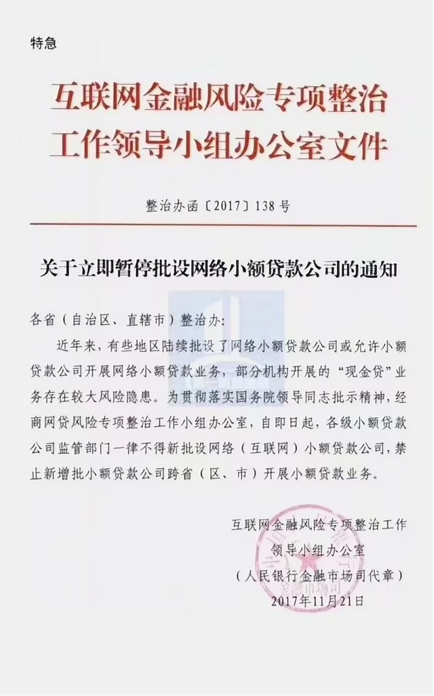

2017年11月21日晚，互联网金融风险专项整治工作领导小组办公室下发了《关于立即暂停批设网络小额贷款公司的通知》，要求各地即日起禁止新批网络小贷公司，这意味着网络小贷牌照的发放渠道已经关闭，以下即是全文：

**小结：**现金贷作为一种互联网短期小额信用借款，借款利率高，规模快速增长，不少P2P网贷平台也通过自建借款端或与助贷机构合作的方式参与其中。而据了解，大多数现金贷平台业务存在较大的风险隐患。监管叫停了新发网络小贷牌照，这一行为被认为监管层全面进行现金贷监管的开始。

