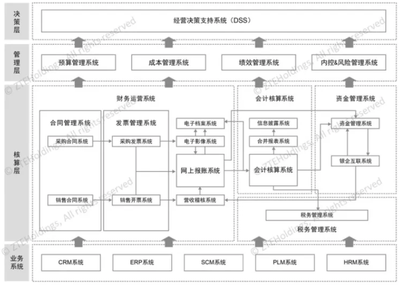

# [财务信息化系统架构设计](https://www.cnblogs.com/barrywxx/p/10779330.html)

​	从本质上说，每一个企业都可以抽象为业务循环、管理循环和信息循环。在这三大循环中，信息循环是连接业务循环和管理循环的重要纽带，为管理循环提供决策支持。而信息循环的高效运转，则需要信息系统作为重要支撑。作为承载业务流并实现业务数据自动传递和集成的使能器，企业信息系统的目标是实现端到端的业务流覆盖，承载所有的作业和数据。

**财务属于信息循环的重要构成部分，财务从本质上来说就是一个信息系统。**企业经营中的每一笔交易和经济事项，产生的数据最终都会汇集到财务系统。财务就是收集、记录、加工财务数据，提供财务信息的一套“信息系统”。

财务信息系统作为企业信息系统的重要组成部分，通过应用创新的信息技术、支撑财务四大职能及财务循环在信息系统中的实现，助力企业财务的流程再造、组织变革，帮助企业实现财务转型。

一、**财务信息系统的发展**

财务信息系统的发展经过了电子处理系统（EDP）、部门内信息集成、企业内的过程集成、企业间的过程集成四个阶段。

**1. 电子处理系统阶段（EDP阶段）。**这一阶段没有会计信息系统，只有多种互相独立的会计核算程序，一种会计核算程序仅能对应某项会计业务独立完成，不具备财务与业务一体化的基本理念。

**2. 部门内信息集成阶段。**人们将部门内的计算机应用集成、共享数据，使得信息“来源唯一、实时共享”。该阶段，会计信息系统可称为会计管理信息系统，实现了部门内的信息集成。

**3. 企业内的过程集成阶段。**在这个阶段，财务信息系统作为一个有机子系统，和企业管理信息系统高度集成，实现了业务处理与会计信息处理的集成、财务信息与非财务信息的集成以及核算与管理的集成等。

**4. 企业间的过程集成阶段。**在该阶段，企业内部信息系统与外部供应商、客户、银行、事务所、税务局、其他政府监管机构的信息系统集成起来，形成一个集成化网络。企业间的过程集成使得决策者更加及时、准确、细致地了解企业内外部环境、掌握市场变化，使会计信息系统更好地辅助企业经营管理决策

二、**财务信息系统架构**

从财务信息系统发展的四个阶段可以看出，财务信息系统的规划和设计需要与企业的战略目标、业务流程以及财务的职能紧密相关，支撑财务循环及财务职能在信息系统中的实现。

在企业运营中，财务信息系统扮演着两种重要的角色：一是支持财务业务流程和财务运营过程，提高财务业务运作效率；二是支持管理者做出更好的决策。财务活动可划分为财务交易处理、管理控制和决策支持三个层次，财务信息系统相应地也可以分为核算层、管理层和决策层，覆盖从业务系统数据采集到财务作业处理、管理控制以及经营决策信息的发布，全面支持财务循环及财务职能的实现。财务信息系统整体架构如图1所示。

图1  财务信息系统的整体框架

**（一）业务层信息系统**

业务层信息系统覆盖企业价值链的业务过程和管理过程，支持企业主要的业务过程。业务层信息系统主要为业务人员使用，但在系统设计时需在业务需求基础上充分考虑财务需求，将财务所需数据和信息的采集节点放到业务前端，业务人员进行业务处理过程中产生的数据和信息自动对接流转至核算层财务信息系统。

**（二）核算层信息系统**

核算层信息系统支持财务会计交易处理、财务报告、资金管理、税务管理的职能，主要处理源于企业业务系统与用于财务交易处理的数据，可以提供多种供企业内、外部使用的财务报告和财务信息。核算层信息系统可以分为财务运营系统、会计核算系统、资金管理系统和税务管理系统等。

**1.财务运营系统，**主要进行财务基础交易业务的处理，替代传统手工运作，与业务信息系统对接，收集、记录并处理财务交易事务产生的数据，并对财务基础数据信息进行统一管理。财务运营系统主要包括合同管理系统（销售合同管理系统、采购合同管理系统）、发票管理系统（销售开票系统、采购发票系统）、营收稽核系统、网上报账系统、电子影像系统、电子档案系统等。

**2.会计核算系统，**负责提供公司股东、政府、债权人等所用的财务报告和信息。会计核算系统支持财务会计循环，是会计凭证、财务信息自动生成、月末自动记账、过账、编制报表的系统。同时，通过合并报表功能处理复杂的股权关系业务和合并抵销等，出具合并报表和进行信息披露。会计核算系统包括狭义会计核算系统（从凭证到会计报表）、合并报表系统和信息披露系统等。

**3.资金管理系统，**即对资金计划、资金调度和资金结算进行运作管理的信息系统，和会计核算系统、业务系统、银行系统贯穿，实现资金的全流程管理。资金管理系统的功能一般包括账户管理、资金计划管理、资金结算、银企互联、资金监控、银企对账、票证管理、债务管理和外汇管理等。

**4.税务管理系统，**即企业税务核算、税务申报、税务管理的财务信息系统，一般包括税务政策维护、税务数据的采集、税务核算、审核、汇总、税务报表、纳税申报以及税务预测、分析等功能，涵盖企业的间接税、直接税以及转移定价管理等内容，是企业税务管理和监控的平台。

**（三）管理层信息系统**

管理层信息系统包括企业从战略到经营计划、预算管理、过程成本管理、绩效管理以及风险控制管理的相关信息系统功能和模块，其与企业的经营过程及管理要求紧密相关，数据来源于核算层信息系统，经过进一步加工和处理，为管理会计乃至管理提供财务信息。管理层信息系统包括预算管理系统、成本管理系统、绩效管理系统、内控&风险管理系统等。

**1.预算管理系统。**预算管理是衔接公司战略和绩效考核的重要管理工具，作为企业整体管理框架中的重要组成部分，它包含了从战略目标分解、经营计划制定、预算方案的行程到预算执行过程中的监控、分析和动态预测等一系列管理流程和工作方法。与预算管理的内容相对应，预算管理系统一般包括预算编制、预算执行与控制、预算分析与考核等模块。预算系统需要多种数据作为输入来源，如利润目标、费用数据、财务数据、人工数据等，而预算数据是绩效考核系统和经营决策支持系统所必须的。

**2.成本管理系统。**全成本的管理系统覆盖价值链各环节的成本管理流程，包括在产品研发环节研发项目的目标成本管理、供应链环节的采购成本控制、制造费用管理、库存周转管理、工程交付方面的工程成本管理以及对质量投入与质量损失进行评估的质量成本管理等。其中，研发项目成本管理关键在于设计成本的管理和控制；销售项目成本管理需要在销售订单签订评审阶段考虑全流程成本，企业一般可通过项目四算（概算、预算、核算、决算）进行销售项目成本管理和控制。

**3.绩效管理系统，**该系统围绕公司战略规划和经营目标而设定，一般包括组织KPI指标设计、绩效监控、绩效考核、结果应用等闭环式管理。绩效管理系统需要覆盖全价值链各环节，发挥着推进战略规划落地、过程监控预警以及实施结果评价、绩效激励等全流程的管理作用。

**4.内控&风险管理系统，**涵盖了风险管理、内控管理、风险预警和审计管理等模块。

**（四）决策层信息系统**

决策层信息系统为管理者提供交互式管理决策支持。决策支持系统使用分析模型、专门的数据库、决策者自己的洞察力和判断力及基于计算机的交互式建模过程来支持企业管理决策。经营决策支持系统强调的是对管理决策的支持，需要利用商务智能的技术。

从核算层、管理层和决策层系统的关系看，核算层信息系统关注的是财务交易处理以及财务报表等，并不直接为管理人员提供信息产品，核算层的数据将流转至管理层和决策层；管理层信息系统关注企业经营管理及过程控制；决策层信息系统，强调的是对管理者决策的支持，通常利用商务智能的技术对数据进行集成与展示，向管理层提供经营决策所需信息。